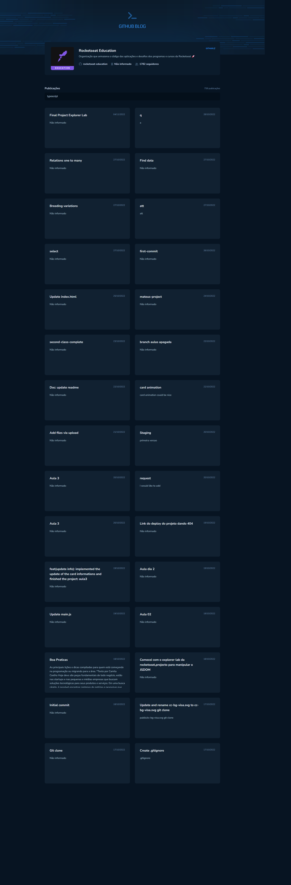
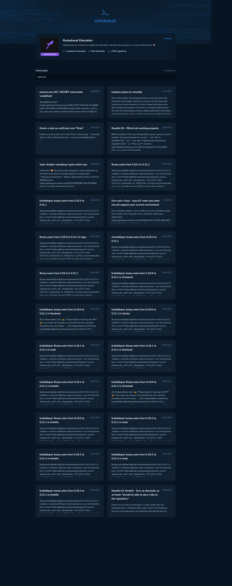

# Github Blog (desafio 03) - Bootcamp Ignite - RocketSeat
### Home

### Search

> Github Blog - Trilha 2022

Projeto desenvolvido como desafio para conclusão do módulo 2 do curso.

## 🔧 Tecnologias
- ReactJS
- TypeScript
- HTML
- CSS
- Git e Github
- Vite

## 📖 Bibliotecas
- React Router DOM
- Styled Components
- Phosphor Icos
- axios

## ✉️ Contato
lauro.almeida@uniriotec.br